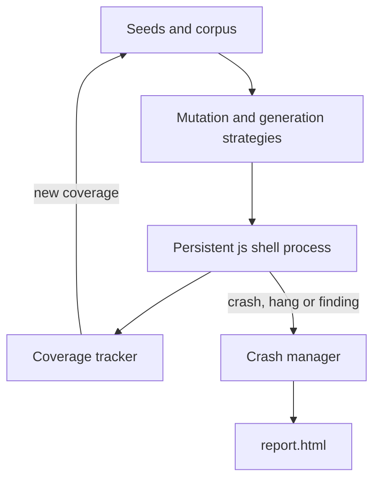

# SpiderFuzz

[](https://github.com/RuslanSemchenko/SpiderFuzz/actions/workflows/ci.yml)
[](LICENSE)

**SpiderFuzz** is a production-grade, coverage-guided fuzzer for the **SpiderMonkey** JavaScript engine (the `js`/`js.exe` shell used by Firefox). It is written in C#/.NET and drives a single, long-lived engine process through thousands of generated and mutated JavaScript programs per second, looking for crashes, hangs, JIT-tier behavioral differences, and semantic regressions.

## Contents

- [Features](#features)
- [Requirements](#requirements)
- [Getting a SpiderMonkey shell](#getting-a-spidermonkey-shell)
  - [Option A: prebuilt shell via fuzzfetch](#option-a-prebuilt-shell-via-fuzzfetch)
  - [Option B: build it yourself with a mozconfig](#option-b-build-it-yourself-with-a-mozconfig)
- [Building SpiderFuzz](#building-spiderfuzz)
- [Quick start](#quick-start)
- [Command-line reference](#command-line-reference)
- [Examples](#examples)
- [Output layout](#output-layout)
- [How it works](#how-it-works)
- [Continuous integration](#continuous-integration)
- [Safety notes](#safety-notes)
- [Project layout](#project-layout)
- [License](#license)

## Features

- **Coverage-guided, persistent-mode fuzzing** — one long-lived `js` process is fed thousands of inputs over stdin instead of being respawned per run, for much higher exec/sec.
- **69 built-in seed programs** across five categories (`Common`, `Targeted`, `Targeted2026`, `Modern2026`, `Experimental2026`), covering classic JIT/CacheIR bug shapes as well as modern (2025-2026) language/engine features (Iterator helpers, `Set` methods, `Uint8Array` base64/hex, explicit resource management, modern `Promise` APIs, `RegExp.escape`, `Object`/`Map.groupBy`, `Float16Array`, `Atomics.pause`, resizable `ArrayBuffer`, and more).
- **46 code generation/mutation strategies**: dictionary and byte-level mutation, structured CacheIR/JIT-shaped mutators, line-level mutation (duplicate/delete/reorder whole statements), AFL-style splice/crossover between two corpus entries, and from-scratch generation.
- **Semantic regression oracle ("findings")**: seeds and generators assert expected behavior; an explicit `new Error(...)` thrown by a failed assertion is treated as a candidate semantic regression, saved separately from engine crashes, and fuzzily deduplicated by message text.
- **JIT-tier differential testing**: a configurable fraction of inputs is re-run under `interpreter` / `baseline-eager` / `ion-eager` to catch tier-specific crashes and behavioral mismatches between tiers.
- **Experimental-feature runner**: a separate persistent process launched with `--enable-*` flags exercises engine surface that exists but isn't on by default yet (Temporal, `Iterator.range`/`zip`/`zipKeyed`/`chunks`, `Promise.allKeyed`, immutable `ArrayBuffer`).
- **Crash/hang minimization and deduplication** so the same underlying bug isn't reported (or saved) over and over.
- **Live HTML dashboard** (`report.html`), refreshed periodically during a run, listing every crash/hang/finding/tier-differential found so far.
- **Parallel workers** (`--workers`), each an independent fuzzing process that periodically syncs its corpus/crashes/findings into the shared output directory.
- **Offline tools**: `--cmin` (afl-cmin-style corpus minimization) and `--triage <dir>` (re-verify old crashes/hangs/findings against a newer engine build, reporting `STILL_CRASHES` / `STILL_HANGS` / `STILL_FINDING` / `FIXED`).
- **AddressSanitizer-aware** crash classification, ASan runtime `PATH` handling included.

## Requirements

- [.NET 10 SDK](https://dotnet.microsoft.com/) (the project targets `net10.0`).
- A SpiderMonkey `js`/`js.exe` shell built with at least `--enable-fuzzing`. `--enable-address-sanitizer` is strongly recommended so crashes are actually caught instead of silently corrupting memory.
- Windows, Linux, or macOS. Paths in this document use Windows examples where it matters (SpiderFuzz's own default target path is Windows-specific), with Linux/macOS notes alongside.

## Getting a SpiderMonkey shell

SpiderFuzz doesn't build SpiderMonkey itself — point it at an existing `js`/`js.exe` binary via `--js`. There are two ways to get one:

### Option A: prebuilt shell via fuzzfetch

The fastest option, and what the CI workflow in this repository uses. [`fuzzfetch`](https://github.com/MozillaSecurity/fuzzfetch) downloads official, pre-built Mozilla fuzzing/ASan builds:

```bash
python -m pip install --upgrade fuzzfetch
python -m fuzzfetch --target js --os Linux --cpu x86_64 --asan --fuzzing --name spidermonkey-js --out ./js-shell
```

The `js` binary ends up nested somewhere under `--out` (typically `<out>/**/dist/bin/js`), so locate it before passing it to `--js`, e.g.:

```bash
find ./js-shell -type f -name js -perm -111 -print -quit
```

This currently only publishes prebuilt archives for Linux/macOS style targets. On Windows, or if you want a debug build with assertions, use Option B.

### Option B: build it yourself with a mozconfig

1. Get the Firefox/mozilla-central source (e.g. via `hg clone https://hg.mozilla.org/mozilla-unified` or the [GitHub mirror](https://github.com/mozilla/gecko-dev)) and run `./mach bootstrap` once to install the required toolchain.
2. Create a `mozconfig` file (commonly placed at the root of the source tree, or pointed to via the `MOZCONFIG` environment variable) that builds **only the SpiderMonkey JS shell** with fuzzing and ASan support enabled. Example, for Windows:

   ```ini
   ac_add_options --with-ccache=sccache

   # Build only the SpiderMonkey JS shell, not the full browser
   ac_add_options --enable-project=js
   ac_add_options --enable-application=js
   ac_add_options --enable-optimize
   ac_add_options --enable-debug
   ac_add_options --disable-shared-js

   # Enable fuzzing hooks and AddressSanitizer
   ac_add_options --enable-fuzzing
   ac_add_options --enable-address-sanitizer

   # Windows only: make sure the ASan runtime DLL shipped with the
   # MozillaBuild clang toolchain is on PATH at runtime. Adjust the
   # username and clang version to match your own .mozbuild install.
   export ASAN_VC_PATH="C:/Users/<your-username>/.mozbuild/clang/lib/clang/<version>/lib/windows"
   export PATH="$PATH:$ASAN_VC_PATH"
   ```

   Line-by-line:

   | Line | Purpose |
   |---|---|
   | `--with-ccache=sccache` | Use `sccache` to speed up incremental rebuilds (optional but recommended). |
   | `--enable-project=js` / `--enable-application=js` | Build only the standalone SpiderMonkey shell, skipping the browser front-end. |
   | `--enable-optimize` | Optimized build, needed for realistic exec/sec while fuzzing. |
   | `--enable-debug` | Keeps `MOZ_ASSERT`/debug-only checks enabled, which catches many logic bugs that a pure release build would silently miss — at the cost of lower throughput. Drop this line for a release-only build if you need maximum speed instead. |
   | `--disable-shared-js` | Produces a static, standalone shell binary. |
   | `--enable-fuzzing` | Enables fuzzing-only testing hooks (e.g. `--fuzzing-safe`); required for meaningful results. |
   | `--enable-address-sanitizer` | Compiles with ASan instrumentation so memory-safety bugs abort with a diagnosable report instead of silently corrupting memory. |
   | `ASAN_VC_PATH`/`PATH` export | **Windows only.** Firefox's Windows ASan runtime lives inside the MozillaBuild clang toolchain directory, not next to `js.exe`; without it on `PATH`, the shell fails to start. Not needed on Linux/macOS, where the ASan runtime is found automatically. |

3. Build with `./mach build` (or `mach.bat build` / the MozillaBuild shell on Windows).
4. The resulting shell binary ends up under the object directory, e.g. `obj-x86_64-pc-windows-msvc\dist\bin\js.exe` on Windows or `obj-*/dist/bin/js` on Linux/macOS — pass that path to SpiderFuzz's `--js` option.

## Building SpiderFuzz

```powershell
dotnet build --configuration Release
```

## Quick start

```powershell
dotnet run --project SpiderFuzz --configuration Release -- --js "C:\path\to\js.exe" --output output
```

```bash
dotnet run --project SpiderFuzz --configuration Release -- --js ./path/to/js --output output
```

Progress is printed periodically (elapsed time, execs, exec/s, corpus size, crashes, hangs, findings, tier differentials); press `Ctrl+C` to stop — the corpus, crashes, hangs, findings, diffs, and `report.html` in the output directory are updated as the run progresses, not only at the end.

## Command-line reference

### Target / paths

| Option | Description |
|---|---|
| `--js, -j <path>` | Path to the SpiderMonkey shell (`js`/`js.exe`). |
| `--output, -o <dir>` | Output directory (default: `output`). |
| `--seeds <dir>` | Directory with extra seed `.js` files, loaded alongside the built-in corpus. |

### Execution tuning

| Option | Default | Description |
|---|---|---|
| `--timeout, -t <ms>` | `5000` | Timeout per execution, in milliseconds. |
| `--iterations, -n <n>` | unlimited | Maximum number of iterations before stopping. |
| `--workers, -w <n>` | `0` | Parallel worker count (`0` = single process). |
| `--seed, -s <n>` | random | Random seed, for reproducible runs. |
| `--persistent` / `--no-persistent` | on | Persistent mode (one long-lived process) vs. spawning a fresh process per input. |

### Features

| Option | Default | Description |
|---|---|---|
| `--asan` / `--no-asan` | on | AddressSanitizer-aware crash classification. |
| `--coverage` / `--no-coverage` | on | Coverage-guided corpus scheduling. |
| `--minimize` / `--no-minimize` | on | Minimize crash/hang reproducers before saving. |
| `--dictionary` / `--no-dictionary` | on | Dictionary-based mutation. |
| `--custom-mutators` / `--no-custom-mutators` | on | Structured CacheIR/JIT-shaped mutators. |
| `--custom-mutator-chance <0-100>` | `35` | Probability of using a structured mutator. |
| `--splice` / `--no-splice` | on | AFL-style crossover between two corpus entries. |
| `--splice-chance <0-100>` | `20` | Crossover probability. |
| `--fresh-generate-chance <0-100>` | `12` | Chance to generate a brand-new input from scratch (one of 46 strategies) instead of mutating the corpus. |
| `--no-resume` | — | Don't load the previous corpus on start. |
| `--no-save-coverage` | — | Don't save new-coverage inputs to `corpus/`. |
| `--differential` / `--no-differential` | on | Re-check inputs across JIT tiers (`interpreter`/`baseline-eager`/`ion-eager`); saves crashes/mismatches to `diffs/`. |
| `--differential-chance <0-100>` | `3` | Per-input probability of running the differential check. |
| `--experimental` / `--no-experimental` | on | Also run inputs against not-yet-shipped engine flags (Temporal, `Iterator.range`/`zip`/`chunks`, `Promise.allKeyed`, immutable `ArrayBuffer`). |
| `--experimental-chance <0-100>` | `5` | Per-input probability of running the experimental check. |

### Offline tools

Run once and exit; still need `--js`/`--output` to point at an existing campaign.

| Option | Description |
|---|---|
| `--cmin` | Minimize `<output>/corpus/` in place (afl-cmin style); redundant entries are moved into a `corpus_removed_<timestamp>/` directory. |
| `--triage <dir>` | Re-run every `.js` file under `<dir>` (e.g. `output/crashes`) against the current `--js` build and report `STILL_CRASHES`/`STILL_HANGS`/`STILL_FINDING`/`FIXED`. |

### Other

| Option | Description |
|---|---|
| `--help, -h` | Show the built-in help text. |

## Examples

Basic single-process run:

```powershell
dotnet run --project SpiderFuzz -c Release -- --js "C:\path\to\js.exe" --output output
```

Use all CPU cores in parallel (mirrors what CI does):

```bash
dotnet run --project SpiderFuzz -c Release -- --js ./js --workers "$(nproc)" --output output
```

Reproducible run with extra seeds and a fixed iteration budget:

```bash
dotnet run --project SpiderFuzz -c Release -- --js ./js --seeds ./my-seeds --iterations 100000 --seed 777
```

Minimize an existing corpus offline:

```bash
dotnet run --project SpiderFuzz -c Release -- --js ./js --output output --cmin
```

Re-verify old crashes/hangs/findings against a newer engine build:

```bash
dotnet run --project SpiderFuzz -c Release -- --js ./new-js --output output --triage output/crashes
```

## Output layout

```text
<output>/
  corpus/      # inputs that found new coverage - fed back into future runs
  crashes/     # real engine crashes (ASan aborts, segfaults, etc.), minimized & deduplicated
  hangs/       # inputs that timed out, minimized & deduplicated
  findings/    # semantic regressions: an oracle assertion failed (new Error(...)); fuzzily
               # deduplicated by message text - always worth a manual look (see Safety notes)
  diffs/       # JIT-tier differentials: same input behaved differently across interpreter/
               # baseline-eager/ion-eager
  stats.json   # machine-readable run stats
  report.html  # live, human-readable dashboard, refreshed periodically during the run
```

## How it works



- **Persistent mode**: a driver script feeds inputs to one long-lived `js` process over stdin and drains the promise job queue after every input, so async oracle failures (`.then()`/async callbacks) are actually observed instead of turning into unhandled rejections that go unnoticed. The process is restarted periodically and after crashes.
- **Coverage-guided scheduling**: each run's stdout/stderr is turned into a signature (normalized token trigrams plus masked error text); the energy scheduler favors corpus entries that keep discovering new signatures.
- **Mutation pipeline**: per iteration, an input is produced via dictionary/byte-level mutation, structured CacheIR/JIT-shaped mutators, line-level mutation, splice/crossover between two corpus entries, or fresh from-scratch generation — drawing on 69 seed programs across five categories and 46 generator strategies.
- **Differential testing and the experimental-feature runner** run alongside (not instead of) normal handling, at a low default chance, since both add real overhead per check.
- **Parallel workers** (`--workers`) each run an independent instance and periodically sync their corpus/crashes/hangs/findings into the shared output directory.

## Continuous integration

`.github/workflows/ci.yml` runs on every push/PR to `master` (and on manual dispatch): it fetches a prebuilt Linux ASan+fuzzing `js` shell via `fuzzfetch`, builds SpiderFuzz, and runs a timeboxed ~2-hour fuzzing campaign using all available CPU cores (`--workers "$(nproc)"`). The resulting `ci-output/` directory (corpus, crashes, hangs, findings, diffs, `report.html`) is uploaded as a workflow artifact.

## Safety notes

- Always fuzz a local, disposable build of the engine — never a production browser installation.
- Persistent mode restarts the target process frequently and parallel workers/differential/experimental checks can spawn many child processes; prefer running in a sandboxed or otherwise disposable environment.
- `findings/` entries are **candidates** for manual review, not confirmed bugs: an oracle assertion failing is a strong signal, but a line-level mutation can occasionally break the code path that computes the very value being asserted, producing a false positive.
- Crash/hang/finding reproducers saved to disk are plain `.js` files; don't execute them with a non-fuzzing, unsandboxed browser build.

## Project layout

| File | Responsibility |
|---|---|
| `SpiderFuzz/Program.cs` | CLI entry point: argument parsing, dispatch to fuzzing/parallel/`--cmin`/`--triage` modes. |
| `SpiderFuzz/Fuzzer/FuzzerEngine.cs` | Main fuzzing loop; owns the coverage tracker, scheduler, minimizer, differential tester, and experimental runner; defines `FuzzerConfig`. |
| `SpiderFuzz/Fuzzer/PersistentRunner.cs` | Drives the long-lived `js` shell process in persistent mode (stdin/stdout protocol, job-queue draining, restart handling). |
| `SpiderFuzz/Fuzzer/ProcessRunner.cs` | Spawns a fresh `js` process per input (non-persistent mode, differential/experimental re-runs); classifies crashes. |
| `SpiderFuzz/Fuzzer/CoverageTracker.cs` | Turns each run's output into a coverage signature to detect new behavior. |
| `SpiderFuzz/Fuzzer/EnergyScheduler.cs` | Corpus scheduling — decides which corpus entry to mutate next. |
| `SpiderFuzz/Fuzzer/CodeGenerator.cs` | Mutation and from-scratch generation strategies. |
| `SpiderFuzz/Fuzzer/Dictionary.cs` | Token dictionary used by dictionary-based mutation. |
| `SpiderFuzz/Fuzzer/Seeds.cs` | Built-in seed corpus (`Common`, `Targeted`, `Targeted2026`, `Modern2026`, `Experimental2026`). |
| `SpiderFuzz/Fuzzer/CrashManager.cs` | Dedup and persistence of crashes/hangs/findings/diffs, stats, and the live `report.html`. |
| `SpiderFuzz/Fuzzer/InputMinimizer.cs` | Minimizes crash/hang reproducers. |
| `SpiderFuzz/Fuzzer/DifferentialTester.cs` | Re-runs inputs under different JIT tiers to find tier-specific crashes/mismatches. |
| `SpiderFuzz/Fuzzer/CorpusMinimizer.cs` | Offline `--cmin` corpus minimization. |
| `SpiderFuzz/Fuzzer/TriageRunner.cs` | Offline `--triage` re-verification of old crashes/hangs/findings against the current build. |
| `SpiderFuzz/Fuzzer/ParallelManager.cs` | Spawns/manages parallel worker processes and syncs their output. |

## License

SpiderFuzz is distributed under a permissive custom license — see [`LICENSE`](LICENSE). In short: you're free to use, copy, modify, and distribute this software for any purpose, but if you use it (or a derivative of it) anywhere, you must give visible credit with a link back to this repository:

> https://github.com/RuslanSemchenko/SpiderFuzz

See the [`LICENSE`](LICENSE) file for the full terms.
